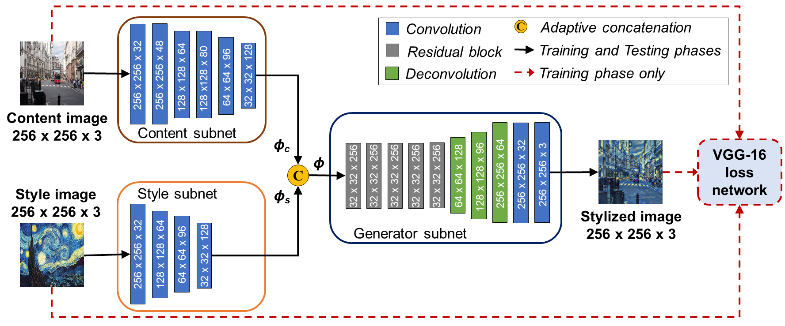

# Balancing Content and Style with Two-Stream FCNs for Style Transfer

This is a PyTorch implementation of the paper "Balancing Content and Style with Two-Stream FCNs for Style Transfer", WACV 2018. 



## Requirements
- [PyTorch](https://github.com/pytorch/pytorch) 0.4
- [Torchvision](https://github.com/pytorch/vision)

## Citation
```
@inproceedings{duc2018Balancing,
  author={Duc Minh Vo, Trung-Nghia Le, Akihiro Sugimoto},
  title={Balancing Content and Style with Two-Stream FCNs for Style Transfer},
  booktitle={WACV},
  year={2018}
}
```

## To do list
- [x] Create repo
- [ ] Commit code
- [ ] Upload pre-trained models
